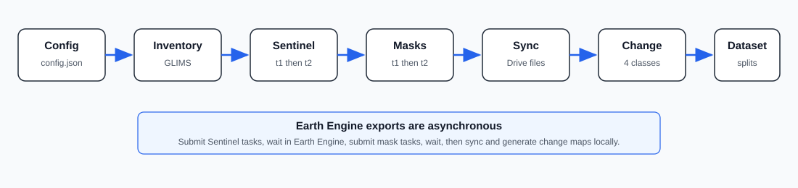
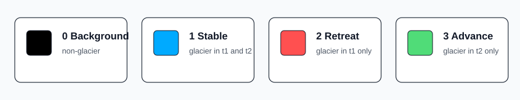
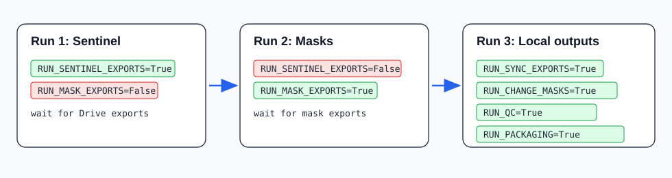

# Indian Glacier Change Dataset (IGCD)

IGCD is a Python and Google Colab pipeline for building a glacier change
detection dataset from public satellite and geospatial data. It uses
[GLIMS Glacier Inventory](https://www.glims.org/),
[Sentinel-2 Level-2A Surface Reflectance](https://developers.google.com/earth-engine/datasets/catalog/COPERNICUS_S2_SR_HARMONIZED),
[Copernicus GLO-30 DEM](https://developers.google.com/earth-engine/datasets/catalog/COPERNICUS_DEM_GLO30),
[Google Earth Engine](https://earthengine.google.com/), and
[Google Drive](https://www.google.com/drive/).

The repository is designed for MSc/PhD research, publication-quality dataset
generation, and deep learning experiments on glacier change detection.



## What This Project Generates

- Clean glacier inventory with stable IDs such as `IGCD_000001`.
- Cloud-masked Sentinel-2 composites for two observation years.
- Year-specific glacier masks.
- Four-class glacier change maps.
- PNG previews for visual inspection.
- Quality-control reports.
- Train/validation/test splits.
- Dataset metadata for machine learning workflows.



Change-mask labels:

| Value | Class | Meaning |
|---:|---|---|
| `0` | Background | Non-glacier pixel |
| `1` | Stable Glacier | Glacier in both `t1` and `t2` |
| `2` | Glacier Retreat | Glacier in `t1`, not glacier in `t2` |
| `3` | Glacier Advance | Not glacier in `t1`, glacier in `t2` |

## Repository Structure

```text
config/
  config.json
docs/
  assets/
igcd/
  config.py
  ee_utils.py
  sentinel.py
  glacier_inventory.py
  dem.py
  spectral.py
  glacier_delineation.py
  morphology.py
  change_detection.py
  quality_control.py
  packaging.py
  raster_viewer.py
  visualization.py
  io.py
  utils.py
notebooks/
  IGCD_End_to_End_Pipeline.ipynb
  Satellite_GeoTIFF_Viewer.ipynb
  Change_Map_Set_Viewer.ipynb
  00_Project_Setup.ipynb
  01_Environment.ipynb
  02_Glacier_Inventory.ipynb
  03_Sentinel_Download.ipynb
  04_Glacier_Delineation.ipynb
  05_Change_Mask_Generation.ipynb
  06_Quality_Control.ipynb
  07_Dataset_Packaging.ipynb
tests/
requirements.txt
pyproject.toml
```

## Main Notebooks

| Notebook | Purpose |
|---|---|
| [`IGCD_End_to_End_Pipeline.ipynb`](notebooks/IGCD_End_to_End_Pipeline.ipynb) | Main all-in-one workflow |
| [`Satellite_GeoTIFF_Viewer.ipynb`](notebooks/Satellite_GeoTIFF_Viewer.ipynb) | Upload/open any `.tif` and inspect bands, RGB composites, overlays, and histograms |
| [`Change_Map_Set_Viewer.ipynb`](notebooks/Change_Map_Set_Viewer.ipynb) | View `t1`, `t2`, change map, and change overlay as one sample set |
| [`00_Project_Setup.ipynb`](notebooks/00_Project_Setup.ipynb) to [`07_Dataset_Packaging.ipynb`](notebooks/07_Dataset_Packaging.ipynb) | Modular workflow for debugging each stage separately |

## Installation

### Google Colab

Open the repository folder in Google Drive and run:

```python
%pip install -q -r requirements.txt
```

The notebooks also include an `INSTALL_DEPENDENCIES` flag that installs the
required packages inside Colab.

### Local Development

```bash
python -m pip install -r requirements.txt
python -m pip install -e .
pytest
```

## Required Google Setup

Before running Earth Engine exports:

1. Create or select a Google Cloud project.
2. Enable Google Earth Engine for that project.
3. Authenticate Earth Engine in Colab.
4. Make sure Google Drive has enough storage for exported GeoTIFF files.
5. Update [`config/config.json`](config/config.json).

Important config fields:

```json
{
  "earth_engine": {
    "project": "your-google-cloud-project-id",
    "glims_asset": "projects/your-project/assets/glims_polygons",
    "sentinel_collection": "COPERNICUS/S2_SR_HARMONIZED",
    "dem_collection": "COPERNICUS/DEM/GLO30_2024_1"
  },
  "temporal": {
    "baseline_year": 2018,
    "target_year": 2023,
    "years": [2018, 2023]
  },
  "export": {
    "drive_folder": "IGCD_exports",
    "max_tasks_per_run": 3000,
    "check_existing_queue": false
  },
  "processing": {
    "max_glaciers_per_export_batch": 1500
  }
}
```

## Exact Run Order

Earth Engine exports are asynchronous. After a cell submits export tasks, the
work continues on Earth Engine servers even if Colab disconnects.

Use the all-in-one notebook:

[`notebooks/IGCD_End_to_End_Pipeline.ipynb`](notebooks/IGCD_End_to_End_Pipeline.ipynb)



### Run 1: Prepare Inventory and Submit Sentinel Exports

Use this when starting a new batch.

```python
RUN_SETUP = True
RUN_ENVIRONMENT = True
RUN_INVENTORY = True

RUN_SENTINEL_EXPORTS = True
RUN_MASK_EXPORTS = False

RUN_SYNC_EXPORTS = False
RUN_CHANGE_MASKS = False
RUN_QC = False
RUN_PACKAGING = False

MAX_GLACIERS_FOR_RUN = 1500
MAX_EXPORT_TASKS_PER_RUN = 3000
```

This submits:

```text
1500 Sentinel exports for t1
1500 Sentinel exports for t2
```

After submission, wait until Earth Engine tasks finish and files appear in:

```text
MyDrive/IGCD_exports/
```

### Run 2: Submit Glacier Mask Exports

Use this only after Sentinel export tasks are complete.

```python
RUN_SETUP = False
RUN_ENVIRONMENT = True
RUN_INVENTORY = False

RUN_SENTINEL_EXPORTS = False
RUN_MASK_EXPORTS = True

RUN_SYNC_EXPORTS = False
RUN_CHANGE_MASKS = False
RUN_QC = False
RUN_PACKAGING = False

MAX_GLACIERS_FOR_RUN = 1500
MAX_EXPORT_TASKS_PER_RUN = 3000
```

This submits:

```text
1500 glacier mask exports for t1
1500 glacier mask exports for t2
```

After submission, wait until Earth Engine tasks finish and mask files appear in:

```text
MyDrive/IGCD_exports/
```

### Run 3: Sync Files, Generate Change Maps, QC, and Package Dataset

Use this only after all Sentinel and mask exports are complete.

```python
RUN_SETUP = False
RUN_ENVIRONMENT = False
RUN_INVENTORY = False

RUN_SENTINEL_EXPORTS = False
RUN_MASK_EXPORTS = False

RUN_SYNC_EXPORTS = True
RUN_CHANGE_MASKS = True
RUN_QC = True
RUN_PACKAGING = True
```

This does not submit new Earth Engine tasks. It only processes exported files
already saved in Google Drive.

## Output Folders

Earth Engine writes exports to:

```text
MyDrive/IGCD_exports/
```

The sync stage organizes those files into the project:

```text
exports/<year>/
data/processed/masks/<year>/
data/processed/change_masks/
reports/change_previews/
reports/change_set_previews/
reports/quality_report.csv
reports/quality_summary.json
dataset/images/
dataset/labels/
dataset/metadata/
```

Runtime images generated by notebooks:

| Image | Generated by | Path |
|---|---|---|
| Inventory overview | Inventory stage | `reports/inventory_overview.png` |
| Change-map preview | Change-mask stage | `reports/change_previews/<glacier_id>_change.png` |
| Change set preview | Change viewer notebook | `reports/change_set_previews/<glacier_id>_2018_2023_change_set.png` |
| Satellite viewer preview | Satellite viewer notebook | `reports/satellite_viewer_previews/<name>_preview.png` |

Example Markdown to add real generated images after you create them:

```markdown


```

## Visual Inspection Tools

### Satellite GeoTIFF Viewer

Open [`Satellite_GeoTIFF_Viewer.ipynb`](notebooks/Satellite_GeoTIFF_Viewer.ipynb)
to upload or select any satellite `.tif`.

It supports:

- RGB and false-color composites.
- Single-band preview with colormaps.
- Band statistics.
- Histograms.
- Threshold overlays.
- PNG preview export.

### Change Map Set Viewer

Open [`Change_Map_Set_Viewer.ipynb`](notebooks/Change_Map_Set_Viewer.ipynb)
after `RUN_CHANGE_MASKS=True`.

It shows:

- Baseline image `t1`.
- Target image `t2`.
- Corresponding change map.
- Optional change overlay on `t1` or `t2`.
- Pixel counts for each change class.

## Dataset Packaging

The packaging stage creates:

```text
dataset/
  images/
  labels/
  metadata/
    splits.csv
    manifest.csv
    dataset_info.json
    label_definition.json
```

Splits are assigned by glacier ID:

```text
70% train
10% validation
20% test
```

The same glacier never appears in more than one split.

## Configuration Reference

All parameters are controlled by [`config/config.json`](config/config.json).

| Section | Meaning |
|---|---|
| `earth_engine` | Google project and Earth Engine dataset IDs |
| `study_area` | Bounding box and region metadata |
| `temporal` | Baseline year, target year, and seasonal window |
| `inventory` | GLIMS batch download settings |
| `sentinel` | Bands, cloud masking, image collection, ROI buffer |
| `dem` | DEM source and elevation limits |
| `delineation` | NDSI/NDWI, slope, elevation, and threshold settings |
| `morphology` | Opening, closing, hole filling, object filtering |
| `export` | Drive folder, CRS, scale, task limits, dtype |
| `processing` | Number of glaciers per export batch |
| `quality_control` | Alignment, resolution, cloud, and area-change checks |
| `splits` | Train/validation/test ratios |
| `paths` | Local project folders |

## Common Problems

### Colab Session Terminates

This is usually fine. Once Earth Engine export tasks are submitted, they run on
Earth Engine servers. Reopen Colab later and continue with the next stage.

### Too Many Earth Engine Tasks

If the Earth Engine queue is not empty, clear old tasks first or set:

```json
"check_existing_queue": true
```

inside `export`.

For normal use after clearing the queue, keep:

```json
"check_existing_queue": false
```

### Exported Files Are Outside the Project Folder

This is normal. Earth Engine saves to:

```text
MyDrive/IGCD_exports/
```

Run:

```python
RUN_SYNC_EXPORTS = True
```

to organize exports into the project directory.

### Deprecated DEM Warning

The project uses:

```text
COPERNICUS/DEM/GLO30_2024_1
```

If you still see a warning for `COPERNICUS/DEM/GLO30`, update your Colab copy of
`config/config.json`.

## Testing

Local unit tests cover numerical functions and packaging helpers:

```bash
pytest
```

Earth Engine integration must be verified in Colab with authenticated Google
credentials.

## Notes for Research Use

- Keep raw exported Sentinel imagery unchanged.
- Do not mix model-specific tiling, normalization, or augmentation into this
  dataset generation pipeline.
- Use the viewer notebooks to manually inspect sample quality before training
  deep learning models.
- Review `quality_report.csv` before publishing or using the packaged dataset.


# © Copyright Notice

**© 2026 Kundan Ghosh. All Rights Reserved.**

The **Indian Glacier Change Dataset (IGCD)** and its associated generation pipeline are developed for research and educational purposes. You may use this dataset for academic and non-commercial research, provided that proper attribution is given. If you redistribute or modify the dataset or pipeline, you must clearly indicate the changes made and retain this copyright notice.


## Acknowledgment

Please include the following acknowledgment in your work:

> *This work uses the Indian Glacier Change Dataset (IGCD), developed by Kundan Ghosh using Google Earth Engine and Sentinel-2 imagery.*

## License

This project is intended for research and educational use. For commercial use, redistribution, or licensing inquiries, please contact the author.
