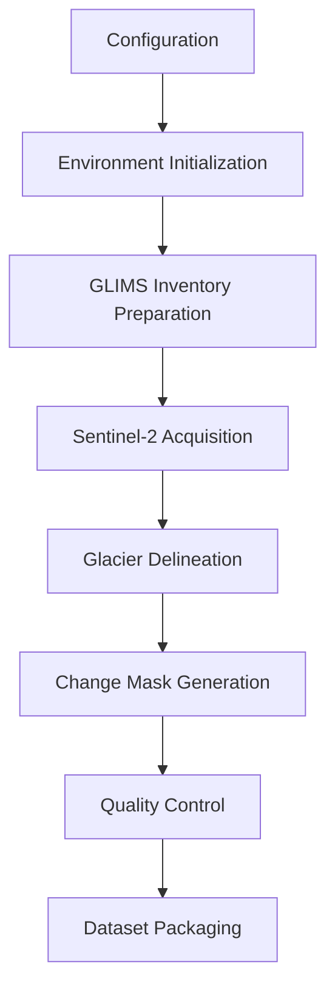

# Indian Glacier Change Dataset Pipeline

IGCD is a research-grade Python package and Colab workflow for generating a glacier change detection dataset from GLIMS glacier inventory polygons, Sentinel-2 Level-2A Surface Reflectance imagery, and Copernicus GLO-30 DEM data through Google Earth Engine.

The notebooks are thin orchestration layers. Core logic lives in `igcd/` so the workflow is testable, reusable, and suitable for processing large glacier inventories.

## Outputs

- Cloud-masked Sentinel-2 seasonal composites.
- Cleaned GLIMS-based glacier inventory with stable `IGCD_000001` identifiers.
- Year-specific glacier masks aligned to Sentinel imagery.
- Four-class glacier change masks:
  - `0` background
  - `1` stable glacier
  - `2` glacier retreat
  - `3` glacier advance
- Quality reports and processing manifests.
- Glacier-grouped train/validation/test splits.
- Dataset metadata and label definitions.

## Workflow



## Installation

In Google Colab, run the notebooks in order from `notebooks/`. For local development:

```bash
python -m pip install -r requirements.txt
python -m pip install -e .
pytest
```

Earth Engine access requires a Google Cloud project with Earth Engine enabled. Update `config/config.json` before running acquisition jobs:

```json
{
  "earth_engine": {
    "project": "Your-Google-Cloud-Project-ID"
  }
}
```

## Repository Layout

```text
config/
  config.json
igcd/
  config.py
  ee_utils.py
  sentinel.py
  glacier_inventory.py
  dem.py
  spectral.py
  glacier_delineation.py
  morphology.py
  change_detection.py
  quality_control.py
  packaging.py
  visualization.py
  io.py
  utils.py
notebooks/
  Change_Map_Set_Viewer.ipynb
  Satellite_GeoTIFF_Viewer.ipynb
  IGCD_End_to_End_Pipeline.ipynb
  00_Project_Setup.ipynb
  01_Environment.ipynb
  02_Glacier_Inventory.ipynb
  03_Sentinel_Download.ipynb
  04_Glacier_Delineation.ipynb
  05_Change_Mask_Generation.ipynb
  06_Quality_Control.ipynb
  07_Dataset_Packaging.ipynb
tests/
```

## Configuration

All operational settings are stored in `config/config.json`. Important sections:

- `temporal`: observation years and seasonal windows.
- `inventory`: GLIMS download batch size and optional feature cap.
- `sentinel`: Sentinel-2 collection, bands, cloud thresholds, ROI buffering, and composite reducer.
- `dem`: Copernicus DEM source and elevation limits.
- `delineation`: adaptive threshold options and fallback spectral/terrain thresholds.
- `morphology`: opening, closing, hole filling, and component filtering.
- `quality_control`: resolution, cloud, alignment, and area-change tolerances.
- `export.sentinel_dtype`: exported Sentinel stack dtype. Keep `float32` to avoid Earth Engine mixed-band export errors.
- `export.max_tasks_per_run`: maximum Earth Engine export tasks submitted in one run. Default is `3000`.
- `export.check_existing_queue`: optional Earth Engine queue pre-check. Default is `false`; set `true` only when you want the exporter to account for already queued tasks.
- `processing.max_glaciers_per_export_batch`: number of glaciers used for one export batch. Default is `1500`, which gives `1500` baseline-year Sentinel exports plus `1500` target-year Sentinel exports.
- `splits`: glacier-level train/validation/test ratios.
- `paths`: local and Drive-backed project paths.

## Usage

Satellite image viewer:

Open `notebooks/Satellite_GeoTIFF_Viewer.ipynb` to upload or select any
GeoTIFF and inspect it interactively. It supports RGB and false-color
composites, single-band previews, threshold overlays, histograms, metadata, and
PNG preview export.

Change-map set viewer:

Open `notebooks/Change_Map_Set_Viewer.ipynb` after `RUN_CHANGE_MASKS=True` has
created change rasters. It shows each sample as baseline image, target image,
4-class change map, and optional change overlay.

IGCD dataset generation:

Single-notebook workflow:

1. Open `notebooks/IGCD_End_to_End_Pipeline.ipynb` in Colab.
2. Edit `config/config.json`, especially `earth_engine.project`, `study_area`, and `temporal`.
3. Run setup, environment, inventory, Sentinel export, and mask export stages.
4. Wait for Earth Engine Drive export tasks to finish.
5. Rerun the notebook with `RUN_SYNC_EXPORTS`, `RUN_CHANGE_MASKS`, `RUN_QC`, and `RUN_PACKAGING` enabled.

Modular workflow:

1. Run `00_Project_Setup.ipynb` to create project folders and default config.
2. Edit `config/config.json`, especially `earth_engine.project`, `study_area`, and `temporal`.
3. Run `01_Environment.ipynb` to install dependencies and authenticate Earth Engine.
4. Run notebooks `02` through `07` sequentially.

Long-running Earth Engine exports are resumable. The Sentinel acquisition notebook writes an acquisition manifest and skips files that already exist when `export.skip_existing` is true.

For Earth Engine task limits, do not submit Sentinel and mask exports in the
same run. Submit Sentinel exports for both configured years first, wait for
those tasks to finish, then submit mask exports for both years, then generate
change masks locally after downloaded exports are organized.

If old tasks are already queued, either clear them first or set
`export.check_existing_queue` to `true` so the exporter accounts for occupied
queue slots.

## Development Notes

- Keep model-specific preprocessing, tiling, normalization, and augmentation outside this dataset generation pipeline.
- Use server-side Earth Engine operations for image filtering, compositing, and export wherever possible.
- Unit tests cover local numerical logic; Earth Engine integration should be verified in Colab with authenticated credentials.
